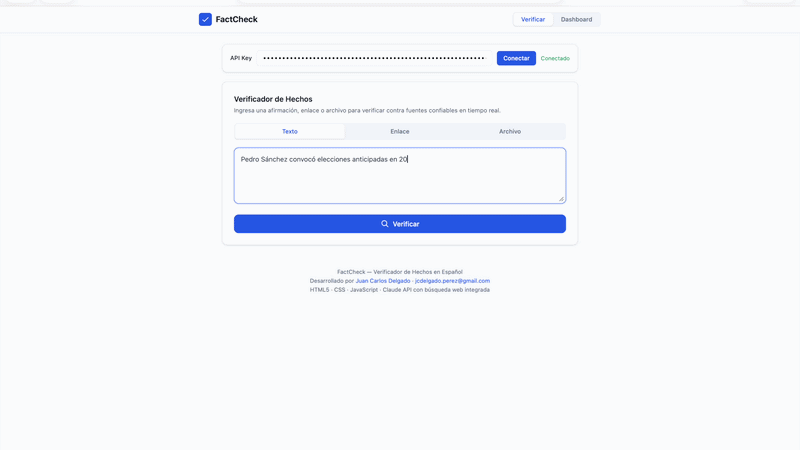

# FactCheck — Verificador de Hechos en Español

Aplicación web de fact-checking en tiempo real que clasifica afirmaciones en tres niveles de verificación (verificado / sin información / no verificable), contrastando contra medios confiables mediante IA con búsqueda web integrada.

## Demo

[Ver video completo en YouTube](https://youtu.be/SpPIJchtTAE)

## Cómo funciona

1. Ingresa una afirmación, enlace o archivo
2. El sistema consulta fuentes confiables en tiempo real
3. Clasifica el resultado con veredicto, fuentes y nivel de confianza

## Stack técnico

- HTML5 / CSS3 / JavaScript
- Anthropic API (Claude) con búsqueda web integrada
- Prompt Engineering
- Diseño de output estructurado (JSON)

## Probar la app

[Abrir FactCheck](https://jcdelgadop.github.io/factcheck.html)

Requiere API Key de Anthropic para funcionar.

## Autor

**Juan Carlos Delgado** — Trust & Safety Specialist

- [Portfolio](https://jcdelgadop.github.io)
- [LinkedIn](https://www.linkedin.com/in/juan-carlos-delgado)
- [YouTube](https://youtube.com/@jcdelgadop)

<!-- Migración NEXUS v2 completada 17 jul 2026  -->